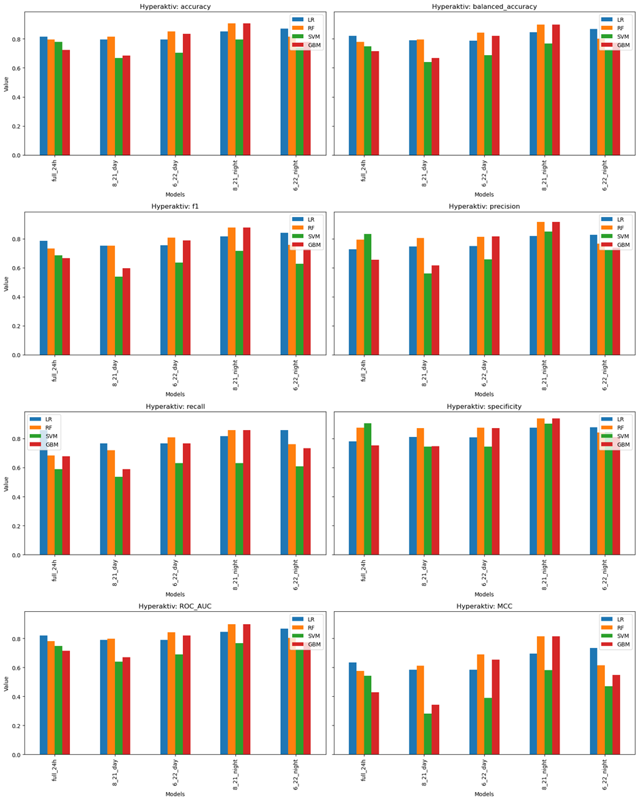
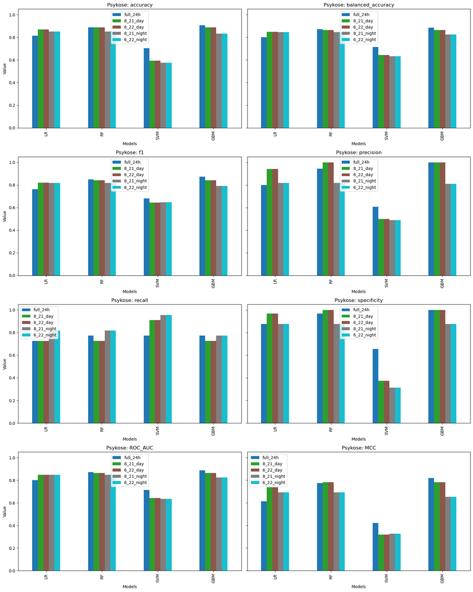

# Mental-Disorder-TS: Klasyfikacja szeregów czasowych

The project aimed to compare time series classification methods for diagnosing neurological and mental disorders based on patients' daily activity data. It was based on the article “Comparison of Manual and Automated Feature Engineering for Daily Activity Classification in Mental Disorder Diagnosis” by J. Adamczyk and F. Malawski.

Used approaches:

* Classification based on the entire time series (complete patient data).
* Multiple Instance Learning (MIL), where data is split into shorter segments (e.g., days), and diagnosis is based on aggregating predictions for these segments (voting).

The effect of dividing data into time windows of varying lengths (whole day, daytime, nighttime) was also studied to identify which data segments provide more diagnostic value.

## Datasets
Three datasets were utilized:
* **Depresjon:** 55 patients (23 with depression, 32 controls).
* **Psykose:** 54 patients (22 with schizophrenia, 32 controls).
* **HYPERAKTIV:** 103 patients (51 with ADHD, 52 controls).

A total of 24 features were extracted as in the reference article. In the traditional method, features were derived from the entire time series, while in MIL, they were extracted from daily segments.

*Table 1. Manually extracted features \
“Comparison of Manual and Automated Feature Engineering for Daily Activity Classification in Mental Disorder Diagnosis” by J. Adamczyk and F. Malawski.*

## Training and evaluation

Four models were tested:
* Logistic regression
* SVM
* Random Forest
* LightGBM

**Evaluation:**
* Entire time series: Nested CV.
* MIL: Nested CV ensuring patient days were not in both training and test sets.

**Metrics:**
* accuracy
* balanced accuracy
* f1-score
* precision
* recall
* specificity
* ROC AUC
* MCC

## Results
### Classical
#### Hyperaktiv

**Full 24h**
| Metric              | LR       | RF       | SVM      | GBM      |
|---------------------|---------|---------|---------|---------|
| accuracy           | 0.814815 | 0.796296 | 0.777778 | 0.722222 |
| balanced_accuracy  | 0.819481 | 0.780141 | 0.747673 | 0.715043 |
| f1                 | 0.784392 | 0.732601 | 0.685648 | 0.665873 |
| precision          | 0.726984 | 0.793651 | 0.833333 | 0.654762 |
| recall             | 0.857143 | 0.684524 | 0.589286 | 0.678571 |
| specificity        | 0.781818 | 0.875758 | 0.906061 | 0.751515 |
| ROC_AUC            | 0.819481 | 0.780141 | 0.747673 | 0.715043 |
| MCC                | 0.634090 | 0.576841 | 0.542123 | 0.428775 |

**Day 8-21**
| Metric             | LR       | RF       | SVM      | GBM      |
|--------------------|---------|---------|---------|---------|
| accuracy          | 0.796296 | 0.814815 | 0.666667 | 0.685185 |
| balanced_accuracy | 0.789989 | 0.796483 | 0.640584 | 0.668885 |
| f1               | 0.753142 | 0.753142 | 0.539239 | 0.597222 |
| precision        | 0.745370 | 0.803704 | 0.561111 | 0.616667 |
| recall          | 0.767857 | 0.720238 | 0.535714 | 0.589286 |
| specificity     | 0.812121 | 0.872727 | 0.745455 | 0.748485 |
| ROC_AUC         | 0.789989 | 0.796483 | 0.640584 | 0.668885 |
| MCC             | 0.582893 | 0.612825 | 0.280791 | 0.342255 |

**Day 6-22**
| Metric             | LR       | RF       | SVM      | GBM      |
|--------------------|---------|---------|---------|---------|
| accuracy          | 0.796296 | 0.851852 | 0.703704 | 0.833333 |
| balanced_accuracy | 0.788474 | 0.842641 | 0.688203 | 0.820292 |
| f1               | 0.753765 | 0.808231 | 0.634921 | 0.787330 |
| precision        | 0.749206 | 0.812169 | 0.657143 | 0.814815 |
| recall          | 0.767857 | 0.809524 | 0.630952 | 0.767857 |
| specificity     | 0.809091 | 0.875758 | 0.745455 | 0.872727 |
| ROC_AUC         | 0.788474 | 0.842641 | 0.688203 | 0.820292 |
| MCC             | 0.584042 | 0.690518 | 0.390566 | 0.653379 |

**Night 21-8**
| Metric             | LR       | RF       | SVM      | GBM      |
|--------------------|---------|---------|---------|---------|
| accuracy          | 0.851852 | 0.907407 | 0.796296 | 0.907407 |
| balanced_accuracy | 0.845617 | 0.898268 | 0.766991 | 0.898268 |
| f1               | 0.814744 | 0.877778 | 0.714646 | 0.877778 |
| precision        | 0.819444 | 0.916667 | 0.850000 | 0.916667 |
| recall          | 0.815476 | 0.857143 | 0.630952 | 0.857143 |
| specificity     | 0.875758 | 0.939394 | 0.903030 | 0.939394 |
| ROC_AUC         | 0.845617 | 0.898268 | 0.766991 | 0.898268 |
| MCC             | 0.694067 | 0.813323 | 0.581019 | 0.813323 |

**Night 22-6**
| Metric             | LR       | RF       | SVM      | GBM      |
|--------------------|---------|---------|---------|---------|
| accuracy          | 0.870370 | 0.814815 | 0.740741 | 0.777778 |
| balanced_accuracy | 0.867965 | 0.802165 | 0.726299 | 0.772132 |
| f1               | 0.841270 | 0.757835 | 0.627622 | 0.728632 |
| precision        | 0.827381 | 0.766667 | 0.722222 | 0.738095 |
| recall          | 0.857143 | 0.761905 | 0.607143 | 0.732143 |
| specificity     | 0.878788 | 0.842424 | 0.845455 | 0.812121 |
| ROC_AUC         | 0.867965 | 0.802165 | 0.726299 | 0.772132 |
| MCC             | 0.733145 | 0.615857 | 0.471487 | 0.549220 |

Analyzing the classification results on the HYPERAKTIV dataset, several interesting patterns emerge. Most notably, the best results were achieved during the night-time window (21:00-8:00). This may be due to the nature of ADHD, as individuals with this disorder often exhibit increased activity at night, have trouble falling asleep, and experience restless and interrupted sleep.

The highest accuracy (90.7%) was achieved by Random Forest and LightGBM in the 21:00–8:00 window. These models also performed best during the daytime window (6:00–22:00) with accuracies of 85% and 83%, respectively. For 8:00–21:00, Random Forest (81%) and Logistic Regression (80%) were most effective, while LightGBM performed poorly at 68.5%. For the full-day classification, Logistic Regression was the most effective, achieving 81% accuracy.

#### Depresjon

**Full 24h**
| Metric             | LR       | RF       | SVM      | GBM      |
|--------------------|---------|---------|---------|---------|
| accuracy          | 0.763158 | 0.596491 | 0.600390 | 0.786070 |
| balanced_accuracy | 0.732792 | 0.574513 | 0.603517 | 0.729444 |
| f1               | 0.658009 | 0.497354 | 0.560185 | 0.638655 |
| precision        | 0.805556 | 0.544444 | 0.518519 | 0.775510 |
| recall          | 0.559524 | 0.470238 | 0.613095 | 0.542857 |
| specificity     | 0.906061 | 0.678788 | 0.593939 | 0.916031 |
| ROC_AUC         | 0.732792 | 0.574513 | 0.603517 | 0.729444 |
| MCC             | 0.505546 | 0.160477 | 0.203477 | 0.509180 |

**Day 8-21**
| Metric             | LR       | RF       | SVM      | GBM      |
|--------------------|---------|---------|---------|---------|
| accuracy          | 0.707602 | 0.743665 | 0.689084 | 0.688109 |
| balanced_accuracy | 0.697132 | 0.733442 | 0.669156 | 0.690639 |
| f1               | 0.645614 | 0.686966 | 0.600275 | 0.663818 |
| precision        | 0.712121 | 0.756614 | 0.652778 | 0.684848 |
| recall          | 0.648810 | 0.654762 | 0.559524 | 0.696429 |
| specificity     | 0.745455 | 0.812121 | 0.778788 | 0.684848 |
| ROC_AUC         | 0.697132 | 0.733442 | 0.669156 | 0.690639 |
| MCC             | 0.431185 | 0.491949 | 0.351153 | 0.406532 |

**Day 6-22**
| Metric             | LR       | RF       | SVM      | GBM      |
|--------------------|---------|---------|---------|---------|
| accuracy          | 0.707602 | 0.761209 | 0.689084 | 0.688109 |
| balanced_accuracy | 0.697132 | 0.754275 | 0.669156 | 0.690639 |
| f1               | 0.645614 | 0.716270 | 0.600275 | 0.663818 |
| precision        | 0.712121 | 0.756614 | 0.652778 | 0.684848 |
| recall          | 0.648810 | 0.696429 | 0.559524 | 0.696429 |
| specificity     | 0.745455 | 0.812121 | 0.778788 | 0.684848 |
| ROC_AUC         | 0.697132 | 0.754275 | 0.669156 | 0.690639 |
| MCC             | 0.431185 | 0.523903 | 0.351153 | 0.406532 |

**Night 21-8**
| Metric             | LR       | RF       | SVM      | GBM      |
|--------------------|---------|---------|---------|---------|
| accuracy          | 0.708577 | 0.689084 | 0.546784 | 0.654971 |
| balanced_accuracy | 0.721320 | 0.666504 | 0.527976 | 0.649026 |
| f1               | 0.697596 | 0.586081 | 0.437525 | 0.594444 |
| precision        | 0.612536 | 0.687302 | 0.466667 | 0.588624 |
| recall          | 0.821429 | 0.517857 | 0.422619 | 0.607143 |
| specificity     | 0.621212 | 0.815152 | 0.633333 | 0.690909 |
| ROC_AUC         | 0.721320 | 0.666504 | 0.527976 | 0.649026 |
| MCC             | 0.456174 | 0.358664 | 0.062041 | 0.298861 |

**Night 22-6**
| Metric             | LR       | RF       | SVM      | GBM      |
|--------------------|---------|---------|---------|---------|
| accuracy          | 0.708577 | 0.707602 | 0.546784 | 0.654971 |
| balanced_accuracy | 0.721320 | 0.683171 | 0.527976 | 0.649026 |
| f1               | 0.697596 | 0.603175 | 0.437525 | 0.594444 |
| precision        | 0.612536 | 0.753968 | 0.466667 | 0.588624 |
| recall          | 0.821429 | 0.517857 | 0.422619 | 0.607143 |
| specificity     | 0.621212 | 0.848485 | 0.633333 | 0.690909 |
| ROC_AUC         | 0.721320 | 0.683171 | 0.527976 | 0.649026 |
| MCC             | 0.456174 | 0.409948 | 0.062041 | 0.298861 |

For depression data, unlike ADHD, the highest accuracy was achieved using full-day classification. However, Random Forest and SVM performed better on daytime data, while nighttime classification yielded the poorest results. The best accuracy was achieved by LightGBM (79%) and Logistic Regression (76%) on full-day data, whereas Random Forest and SVM only reached ~60%.

On daytime data (8:00–21:00), Random Forest achieved 74% accuracy, and SVM 69%. Random Forest excelled in the 6:00–22:00 range with 76% accuracy, outperforming other models, which scored 70–71%. All models struggled on nighttime data, with none exceeding 71%.

Overall, the Depresjon dataset produced lower classification accuracy than HYPERAKTIV, likely due to the less pronounced deviations in activity patterns among patients with depression and the smaller dataset size (half as many patients).

#### Psykose

**Full 24h**
| Metric             | LR       | RF       | SVM      | GBM      |
|--------------------|---------|---------|---------|---------|
| accuracy          | 0.814815 | 0.759259 | 0.777778 | 0.722222 |
| balanced_accuracy | 0.819481 | 0.735498 | 0.747673 | 0.715043 |
| f1               | 0.784392 | 0.665446 | 0.685648 | 0.665873 |
| precision        | 0.726984 | 0.771429 | 0.833333 | 0.654762 |
| recall          | 0.857143 | 0.595238 | 0.589286 | 0.678571 |
| specificity     | 0.781818 | 0.875758 | 0.906061 | 0.751515 |
| ROC_AUC         | 0.819481 | 0.735498 | 0.747673 | 0.715043 |
| MCC             | 0.634090 | 0.499742 | 0.542123 | 0.428775 |

**Day 8-21**
| Metric             | LR       | RF       | SVM      | GBM      |
|--------------------|---------|---------|---------|---------|
| accuracy          | 0.796296 | 0.796296 | 0.666667 | 0.685185 |
| balanced_accuracy | 0.789989 | 0.781331 | 0.640584 | 0.668885 |
| f1               | 0.753142 | 0.734827 | 0.539239 | 0.597222 |
| precision        | 0.745370 | 0.764021 | 0.561111 | 0.616667 |
| recall          | 0.767857 | 0.720238 | 0.535714 | 0.589286 |
| specificity     | 0.812121 | 0.842424 | 0.745455 | 0.748485 |
| ROC_AUC         | 0.789989 | 0.781331 | 0.640584 | 0.668885 |
| MCC             | 0.582893 | 0.575429 | 0.280791 | 0.342255 |

**Day 6-22**
| Metric             | LR       | RF       | SVM      | GBM      |
|--------------------|---------|---------|---------|---------|
| accuracy          | 0.796296 | 0.814815 | 0.666667 | 0.685185 |
| balanced_accuracy | 0.789989 | 0.796483 | 0.640584 | 0.668885 |
| f1               | 0.753142 | 0.753142 | 0.539239 | 0.597222 |
| precision        | 0.745370 | 0.803704 | 0.561111 | 0.616667 |
| recall          | 0.767857 | 0.720238 | 0.535714 | 0.589286 |
| specificity     | 0.812121 | 0.872727 | 0.745455 | 0.748485 |
| ROC_AUC         | 0.789989 | 0.796483 | 0.640584 | 0.668885 |
| MCC             | 0.582893 | 0.612825 | 0.280791 | 0.342255 |

**Night 21-8**
| Metric             | LR       | RF       | SVM      | GBM      |
|--------------------|---------|---------|---------|---------|
| accuracy          | 0.851852 | 0.907407 | 0.796296 | 0.907407 |
| balanced_accuracy | 0.845617 | 0.898268 | 0.766991 | 0.898268 |
| f1               | 0.814744 | 0.877778 | 0.714646 | 0.877778 |
| precision        | 0.819444 | 0.916667 | 0.850000 | 0.916667 |
| recall          | 0.815476 | 0.857143 | 0.630952 | 0.857143 |
| specificity     | 0.875758 | 0.939394 | 0.903030 | 0.939394 |
| ROC_AUC         | 0.845617 | 0.898268 | 0.766991 | 0.898268 |
| MCC             | 0.694067 | 0.813323 | 0.581019 | 0.813323 |

**Night 22-6**
| Metric             | LR       | RF       | SVM      | GBM      |
|--------------------|---------|---------|---------|---------|
| accuracy          | 0.851852 | 0.907407 | 0.796296 | 0.907407 |
| balanced_accuracy | 0.845617 | 0.898268 | 0.766991 | 0.898268 |
| f1               | 0.814744 | 0.877778 | 0.714646 | 0.877778 |
| precision        | 0.819444 | 0.916667 | 0.850000 | 0.916667 |
| recall          | 0.815476 | 0.857143 | 0.630952 | 0.857143 |
| specificity     | 0.875758 | 0.939394 | 0.903030 | 0.939394 |
| ROC_AUC         | 0.845617 | 0.898268 | 0.766991 | 0.898268 |
| MCC             | 0.694067 | 0.813323 | 0.581019 | 0.813323 |

For the Psykose dataset, the best results were also achieved during nighttime windows, similar to ADHD, likely due to disrupted circadian rhythms in schizophrenia. Symptoms like delusions, hallucinations, and sleep disturbances increase nighttime activity compared to healthy individuals.

Random Forest and LightGBM achieved the highest accuracy (90.7%) for nighttime data, regardless of the time window (21:00–8:00/22:00–6:00). For daytime classification, Random Forest and Logistic Regression performed best (~80%). Logistic Regression was most accurate for full-day data (81%).

Overall, Psykose achieved the highest results across all datasets, likely because schizophrenia, being rarer and more behaviorally distinct, is easier to classify.

Across all datasets, disorder characteristics significantly influenced results. Nighttime data performed better for ADHD and schizophrenia due to increased nocturnal activity, while depression was better classified using full-day data.

### MIL
#### Hyperactiv

**Full 24h**
| Metric            | LR       | RF       | SVM      | GBM      |
|-------------------|----------|----------|----------|----------|
| accuracy          | 0.411765 | 0.482353 | 0.541176 | 0.458824 |
| balanced_accuracy | 0.415278 | 0.480556 | 0.534722 | 0.455556 |
| f1                | 0.390244 | 0.511111 | 0.597938 | 0.500000 |
| precision         | 0.432432 | 0.511111 | 0.557692 | 0.489362 |
| recall            | 0.355556 | 0.511111 | 0.644444 | 0.511111 |
| specificity       | 0.475000 | 0.450000 | 0.425000 | 0.400000 |
| ROC_AUC           | 0.415278 | 0.480556 | 0.534722 | 0.455556 |
| MCC               | -0.170585| -0.038889| 0.071124 | -0.089237|

**Day 8-21**
| Metric            | LR       | RF       | SVM      | GBM      |
|-------------------|----------|----------|----------|----------|
| accuracy          | 0.411765 | 0.470588 | 0.670588 | 0.517647 |
| balanced_accuracy | 0.420833 | 0.473611 | 0.658333 | 0.519444 |
| f1                | 0.324324 | 0.457831 | 0.735849 | 0.517647 |
| precision         | 0.413793 | 0.500000 | 0.639344 | 0.550000 |
| recall            | 0.266667 | 0.422222 | 0.866667 | 0.488889 |
| specificity       | 0.575000 | 0.525000 | 0.450000 | 0.550000 |
| ROC_AUC           | 0.420833 | 0.473611 | 0.658333 | 0.519444 |
| MCC               | -0.166692| -0.052984| 0.351130 | 0.038889 |

**Day 6-22**
| Metric            | LR       | RF       | SVM      | GBM      |
|-------------------|----------|----------|----------|----------|
| accuracy          | 0.423529 | 0.505882 | 0.541176 | 0.458824 |
| balanced_accuracy | 0.430556 | 0.504167 | 0.523611 | 0.458333 |
| f1                | 0.363636 | 0.533333 | 0.654867 | 0.477273 |
| precision         | 0.437500 | 0.533333 | 0.544118 | 0.488372 |
| recall            | 0.311111 | 0.533333 | 0.822222 | 0.466667 |
| specificity       | 0.550000 | 0.475000 | 0.225000 | 0.450000 |
| ROC_AUC           | 0.430556 | 0.504167 | 0.523611 | 0.458333 |
| MCC               | -0.143084| 0.008333 | 0.058926 | -0.083195|

**Night 21-8**
| Metric            | LR       | RF       | SVM      | GBM      |
|-------------------|----------|----------|----------|----------|
| accuracy          | 0.435294 | 0.400000 | 0.470588 | 0.423529 |
| balanced_accuracy | 0.433333 | 0.398611 | 0.455556 | 0.423611 |
| f1                | 0.466667 | 0.426966 | 0.587156 | 0.436782 |
| precision         | 0.466667 | 0.431818 | 0.500000 | 0.452381 |
| recall            | 0.466667 | 0.422222 | 0.711111 | 0.422222 |
| specificity       | 0.400000 | 0.375000 | 0.200000 | 0.425000 |
| ROC_AUC           | 0.433333 | 0.398611 | 0.455556 | 0.423611 |
| MCC               | -0.133333| -0.202553| -0.102869| -0.152524|

**Night 22-6**
| Metric            | LR       | RF       | SVM      | GBM      |
|-------------------|----------|----------|----------|----------|
| accuracy          | 0.470588 | 0.458824 | 0.494118 | 0.494118 |
| balanced_accuracy | 0.465278 | 0.463889 | 0.477778 | 0.497222 |
| f1                | 0.526316 | 0.425000 | 0.612613 | 0.481928 |
| precision         | 0.500000 | 0.485714 | 0.515152 | 0.526316 |
| recall            | 0.555556 | 0.377778 | 0.755556 | 0.444444 |
| specificity       | 0.375000 | 0.550000 | 0.200000 | 0.550000 |
| ROC_AUC           | 0.465278 | 0.463889 | 0.477778 | 0.497222 |
| MCC               | -0.070430| -0.073247| -0.053248| -0.005577|

Using MIL resulted in significantly worse performance compared to the classical approach, where accuracy and balanced accuracy reached ~90%. With MIL, all models fell below 70%, often below 50% or worse. Only SVM performed reasonably well for the 8:00–21:00 window, achieving positive MCC and a recall of 87% (notably higher than precision at 64%). Interestingly, a small shift in the day window (8:00–21:00 to 6:00–22:00) sharply degraded SVM’s performance.

Logistic Regression consistently performed the worst, except for nighttime datasets, where Random Forest usually had the lowest results. However, for 6:00–22:00, Random Forest identified negative cases more effectively (specificity). SVM, despite its relative success, often struggled with specificity.

For the 6:00–22:00 nighttime dataset, LightGBM achieved the best balanced accuracy and tied for accuracy, with a slight edge due to its better specificity.

#### Depresjon

**Full 24h**
| Metric            | LR       | RF       | SVM      | GBM      |
|-------------------|----------|----------|----------|----------|
| accuracy          | 0.781818 | 0.727273 | 0.563636 | 0.745455 |
| balanced_accuracy | 0.757473 | 0.698370 | 0.618886 | 0.707880 |
| f1                | 0.700000 | 0.615385 | 0.647059 | 0.611111 |
| precision         | 0.823529 | 0.750000 | 0.488889 | 0.846154 |
| recall            | 0.608696 | 0.521739 | 0.956522 | 0.478261 |
| specificity       | 0.906250 | 0.875000 | 0.281250 | 0.937500 |
| ROC_AUC           | 0.757473 | 0.698370 | 0.618886 | 0.707880 |
| MCC               | 0.549647 | 0.430875 | 0.304084 | 0.482710 |

**Day 8-21**
| Metric            | LR       | RF       | SVM      | GBM      |
|-------------------|----------|----------|----------|----------|
| accuracy          | 0.745455 | 0.690909 | 0.563636 | 0.709091 |
| balanced_accuracy | 0.713995 | 0.648777 | 0.618886 | 0.658288 |
| f1                | 0.631579 | 0.514286 | 0.647059 | 0.500000 |
| precision         | 0.800000 | 0.750000 | 0.488889 | 0.888889 |
| recall            | 0.521739 | 0.391304 | 0.956522 | 0.347826 |
| specificity       | 0.906250 | 0.906250 | 0.281250 | 0.968750 |
| ROC_AUC           | 0.713995 | 0.648777 | 0.618886 | 0.658288 |
| MCC               | 0.474019 | 0.355370 | 0.304084 | 0.422101 |

**Day 6-22**
| Metric            | LR       | RF       | SVM      | GBM      |
|-------------------|----------|----------|----------|----------|
| accuracy          | 0.745455 | 0.709091 | 0.563636 | 0.709091 |
| balanced_accuracy | 0.713995 | 0.658288 | 0.618886 | 0.658288 |
| f1                | 0.631579 | 0.500000 | 0.647059 | 0.500000 |
| precision         | 0.800000 | 0.888889 | 0.488889 | 0.888889 |
| recall            | 0.521739 | 0.347826 | 0.956522 | 0.347826 |
| specificity       | 0.906250 | 0.968750 | 0.281250 | 0.968750 |
| ROC_AUC           | 0.713995 | 0.658288 | 0.618886 | 0.658288 |
| MCC               | 0.474019 | 0.422101 | 0.304084 | 0.422101 |

**Night 21-8**
| Metric            | LR       | RF       | SVM      | GBM      |
|-------------------|----------|----------|----------|----------|
| accuracy          | 0.581818 | 0.654545 | 0.490909 | 0.654545 |
| balanced_accuracy | 0.548913 | 0.617527 | 0.519701 | 0.617527 |
| f1                | 0.410256 | 0.486486 | 0.533333 | 0.486486 |
| precision         | 0.500000 | 0.642857 | 0.432432 | 0.642857 |
| recall            | 0.347826 | 0.391304 | 0.695652 | 0.391304 |
| specificity       | 0.750000 | 0.843750 | 0.343750 | 0.843750 |
| ROC_AUC           | 0.548913 | 0.617527 | 0.519701 | 0.617527 |
| MCC               | 0.106243 | 0.266165 | 0.041421 | 0.266165 |

**Night 22-6**
| Metric            | LR       | RF       | SVM      | GBM      |
|-------------------|----------|----------|----------|----------|
| accuracy          | 0.581818 | 0.654545 | 0.490909 | 0.654545 |
| balanced_accuracy | 0.548913 | 0.617527 | 0.519701 | 0.617527 |
| f1                | 0.410256 | 0.486486 | 0.533333 | 0.486486 |
| precision         | 0.500000 | 0.642857 | 0.432432 | 0.642857 |
| recall            | 0.347826 | 0.391304 | 0.695652 | 0.391304 |
| specificity       | 0.750000 | 0.843750 | 0.343750 | 0.843750 |
| ROC_AUC           | 0.548913 | 0.617527 | 0.519701 | 0.617527 |
| MCC               | 0.106243 | 0.266165 | 0.041421 | 0.266165 |

For depression, MIL results were closer to those of the classical method, with accuracy/balanced accuracy around 80%. The best results were slightly lower than the classical approach (e.g., full LightGBM: 0.78 vs. full Logistic Regression MIL: 0.782). For some windows, like 8:00–21:00, results slightly improved, typically equating to one more patient being correctly classified.

All models performed best on full-day data and worst on nighttime data, with MIL results consistently below the classical approach by ~5 percentage points. Logistic Regression excelled on full-day and daytime data, while LightGBM and Random Forest performed best for nighttime data. SVM lagged, staying below 60% accuracy.

SVM prioritized positive case classification (higher recall at the expense of specificity), whereas other models favored higher specificity over recall. This tradeoff allowed SVM to occasionally achieve the best f1-score.

Unlike HYPERAKTIV, MCC values were consistently positive. The lowest MCCs (<0.6) were observed for Logistic Regression and SVM on nighttime data.

#### Psykose

**Full 24h**
| Metric            | LR       | RF       | SVM      | GBM      |
|-------------------|----------|----------|----------|----------|
| accuracy          | 0.814815 | 0.888889 | 0.703704 | 0.907407 |
| balanced_accuracy | 0.801136 | 0.870739 | 0.714489 | 0.886364 |
| f1                | 0.761905 | 0.850000 | 0.680000 | 0.871795 |
| precision         | 0.800000 | 0.944444 | 0.607143 | 1.000000 |
| recall            | 0.727273 | 0.772727 | 0.772727 | 0.772727 |
| specificity       | 0.875000 | 0.968750 | 0.656250 | 1.000000 |
| ROC_AUC           | 0.801136 | 0.870739 | 0.714489 | 0.886364 |
| MCC               | 0.612809 | 0.772853 | 0.421847 | 0.817499 |

**Day 8-21**
| Metric            | LR       | RF       | SVM      | GBM      |
|-------------------|----------|----------|----------|----------|
| accuracy          | 0.870370 | 0.888889 | 0.592593 | 0.888889 |
| balanced_accuracy | 0.848011 | 0.863636 | 0.642045 | 0.863636 |
| f1                | 0.820513 | 0.842105 | 0.645161 | 0.842105 |
| precision         | 0.941176 | 1.000000 | 0.500000 | 1.000000 |
| recall            | 0.727273 | 0.727273 | 0.909091 | 0.727273 |
| specificity       | 0.968750 | 1.000000 | 0.375000 | 1.000000 |
| ROC_AUC           | 0.848011 | 0.863636 | 0.642045 | 0.863636 |
| MCC               | 0.736350 | 0.782586 | 0.318529 | 0.782586 |

**Day 6-22**
| Metric            | LR       | RF       | SVM      | GBM      |
|-------------------|----------|----------|----------|----------|
| accuracy          | 0.870370 | 0.888889 | 0.592593 | 0.888889 |
| balanced_accuracy | 0.848011 | 0.863636 | 0.642045 | 0.863636 |
| f1                | 0.820513 | 0.842105 | 0.645161 | 0.842105 |
| precision         | 0.941176 | 1.000000 | 0.500000 | 1.000000 |
| recall            | 0.727273 | 0.727273 | 0.909091 | 0.727273 |
| specificity       | 0.968750 | 1.000000 | 0.375000 | 1.000000 |
| ROC_AUC           | 0.848011 | 0.863636 | 0.642045 | 0.863636 |
| MCC               | 0.736350 | 0.782586 | 0.318529 | 0.782586 |

**Night 21-8**
| Metric            | LR       | RF       | SVM      | GBM      |
|-------------------|----------|----------|----------|----------|
| accuracy          | 0.851852 | 0.851852 | 0.574074 | 0.833333 |
| balanced_accuracy | 0.846591 | 0.846591 | 0.633523 | 0.823864 |
| f1                | 0.818182 | 0.818182 | 0.646154 | 0.790698 |
| precision         | 0.818182 | 0.818182 | 0.488372 | 0.809524 |
| recall            | 0.818182 | 0.818182 | 0.954545 | 0.772727 |
| specificity       | 0.875000 | 0.875000 | 0.312500 | 0.875000 |
| ROC_AUC           | 0.846591 | 0.846591 | 0.633523 | 0.823864 |
| MCC               | 0.693182 | 0.693182 | 0.325792 | 0.652848 |

**Night 22-6**
| Metric            | LR       | RF       | SVM      | GBM      |
|-------------------|----------|----------|----------|----------|
| accuracy          | 0.851852 | 0.851852 | 0.574074 | 0.833333 |
| balanced_accuracy | 0.846591 | 0.846591 | 0.633523 | 0.823864 |
| f1                | 0.818182 | 0.818182 | 0.646154 | 0.790698 |
| precision         | 0.818182 | 0.818182 | 0.488372 | 0.809524 |
| recall            | 0.818182 | 0.818182 | 0.954545 | 0.772727 |
| specificity       | 0.875000 | 0.875000 | 0.312500 | 0.875000 |
| ROC_AUC           | 0.846591 | 0.846591 | 0.633523 | 0.823864 |
| MCC               | 0.693182 | 0.693182 | 0.325792 | 0.652848 |

For the Psykose dataset, MIL performed best, with LightGBM achieving the highest accuracy for full-day data. Every dataset had at least one model reaching ≥83% accuracy. LightGBM, Random Forest, and Logistic Regression showed similar results, with slight variations favoring LightGBM for full-day data and Logistic Regression for nighttime data. Accuracy across different time splits (e.g., 21:00–8:00 vs. 22:00–6:00) was consistent.

SVM struggled with specificity but had better recall, though it's F1-scores were the lowest due to other models outperforming it in recall. Balanced accuracy for SVM was sometimes higher than accuracy due to its focus on positive cases. MCC values for Psykose were the highest across datasets, nearing 0.8 for LightGBM and RF.

Unlike the classical approach, MIL excelled with full-day or daytime data, while nighttime data consistently produced the worst results. Despite some improvements, MIL generally underperformed compared to the classical method. SVM consistently lagged but surprisingly excelled in the challenging HYPERAKTIV dataset, where MCC values for MIL models were generally poor (~<0.5).

Comparison with the Article: MIL did not outperform the classical method, aligning with the article's findings of ~80% accuracy for Depresjon and ~90% for Psykose. The HYPERAKTIV dataset was not analyzed in the article.

